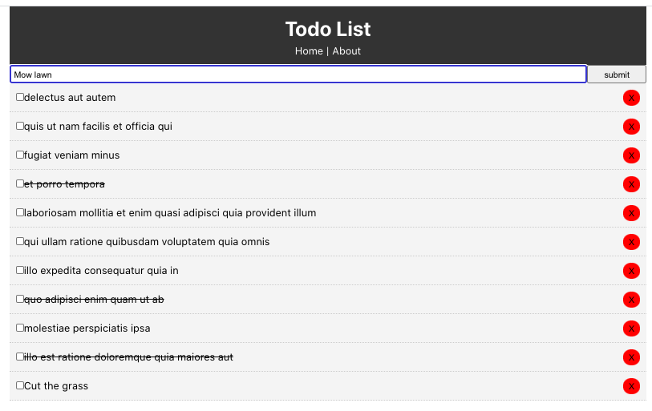
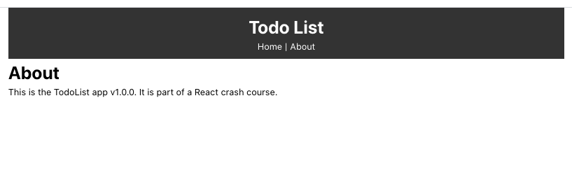

This project was bootstrapped with [Create React App](https://github.com/facebook/create-react-app).

# React ToDo App

## Description

Simple Todo List App

## Screen Shot

### Prerequisites

- [Node.js](https://nodejs.org/en/)

## Install

1. Clone, CD into folder and start npm.

## Use

1. Has 10 pre-populated lorem ipsum todos.
2. Enter new todos in the form and click submit.
3. Check checkbox to complete task.
4. Click the red "x" button to delete todo.

## Built With

- MacOS Catalina
- VS Code
- HTML5
- CSS3
- React
- Create React APP
- uuid v4
- {JSON} Placeholder Typicode
- Axios

## License

None

## Acknowledgement

- Created with assistance from Traversy Media

## Support

If you have suggestions or issues, please email me ryan.gregory@ryanmgregory.com
